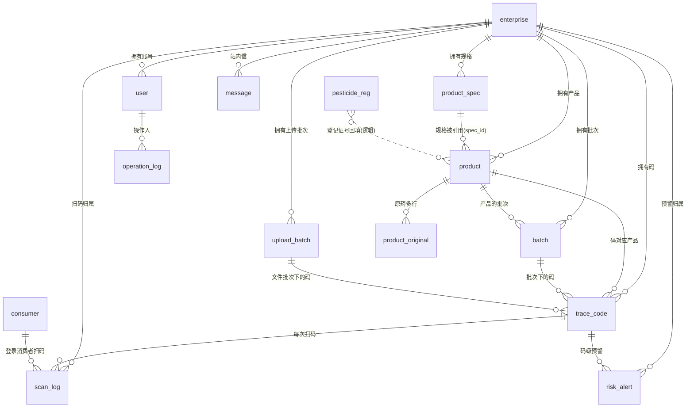

# 05 · 数据库说明

> 生成日期 2026-09-10 · 数据来自 `information_schema` 实测 + `scripts/db-init.mjs` DDL

## 1. 总览

| 项 | 值 |
|---|---|
| 数据库 | `nz315`（MySQL **8.0.46**，服务名 `MySQL80`，端口 3306） |
| 字符集 / 排序 | `utf8mb4` / `utf8mb4_0900_ai_ci` |
| 引擎 | 全部 InnoDB |
| 表数量 | **15 张** = 14 张业务表（`db-init.mjs` 的 DDL 全集）+ **1 张遗留表 `agro_store`**（门店模块已删除，表未清理） |
| 数据量 | 合计约 **46.6 MB**（其中 `pesticide_reg` 占 45.66 MB / 97,471 行） |
| **外键约束** | **0 个**——全部为**逻辑关联**，一致性由代码保证 |
| **存储过程** | **0 个** |
| **存储函数** | **0 个** |
| **触发器** | **0 个** |
| **视图 / 事件** | **0 个** |

> 直接回答交接问题：**本项目没有任何存储过程、函数或触发器**，所有业务逻辑都在 Nitro 服务端（`server/utils` + `server/api`）用 SQL + JS 实现；`db-init.mjs` 里用 JS 函数 `migrate()` / `backfillUploadBatches()` 做幂等结构变更与数据回填（**不是数据库端迁移工具**，无 migration 版本表）。

## 2. 表清单（含实测行数）

| # | 表名 | 中文名 | 实测行数 | 说明 |
|---|---|---|---|---|
| 1 | `enterprise` | 企业（租户） | 2 | 平台入驻厂家；含续费到期日 |
| 2 | `product_spec` | 产品规格主数据 | 81 | 规格码 = 追溯码第 9-11 位，企业内唯一 |
| 3 | `product` | 产品 SKU | 2 | 登记证号**全局唯一** |
| 4 | `product_original` | 产品原药（母药）多行 | 3 | 复配产品多条原药（2026-09-04 多行化） |
| 5 | `batch` | 生产批次 | 1 | 三要素（生产日期/批号/合格证号），同产品下批号唯一 |
| 6 | `trace_code` | 追溯码 | **104** | 核心事实表，亿级（D1 待决） |
| 7 | `upload_batch` | 上传文件批次 | 2 | 码库管理聚合维度（一份上传文件 = 一行） |
| 8 | `user` | 后台用户 | 5 | 4 角色，bcrypt 密码 |
| 9 | `operation_log` | 操作日志 | 607 | 保留 ≥3 年，不可删除 |
| 10 | `scan_log` | 扫码记录 | 106 | 亿级，消费者扫码归属 |
| 11 | `risk_alert` | 风险预警 | 2 | 8 类异常 |
| 12 | `message` | 站内消息 | 26 | 预警/导入完成通知 |
| 13 | `consumer` | 消费者 | 0 | 微信 openid 唯一 |
| 14 | `pesticide_reg` | 农药登记数据源字典 | **97,471** | 只读字典，产品表单自动回填 |
| 15 | `agro_store` | 农资店（**遗留**） | 3 | ⚠️ 门店模块已删除，**表与 3 条演示数据仍在库**，无任何代码引用，可安全清理 |

## 3. 核心表结构

### 3.1 `enterprise`（企业 / 租户）

| 字段 | 类型 | 约束 | 说明 |
|---|---|---|---|
| `id` | BIGINT | PK | |
| `name` | VARCHAR(255) | NOT NULL | 企业名称（**7 项必填之一**） |
| `credit_code` | VARCHAR(50) | **UNIQUE** | 统一社会信用代码（必填） |
| `unit_code` | VARCHAR(32) | NULL | 单元识别码（可空） |
| `contact` / `phone` | VARCHAR | NULL | 联系人 / 联系电话（必填） |
| `legal_person` | VARCHAR(100) | NULL | 法定代表人（必填） |
| `website` / `address` / `description` | — | NULL | ⚠️ **已于 2026-09-08 下线录入与展示，列保留**，存量值不受影响 |
| `logo` | VARCHAR(500) | NULL | 企业 LOGO（未使用 UI） |
| `license_no` | VARCHAR(100) | NULL | 农药生产许可证号（必填） |
| `qualification_expire` | DATE | NULL | 资质到期日（必填，提前 30/60/90 天提醒） |
| `renew_expire` | DATE | NULL | **续费到期日**（2026-09-09 新增）：`NULL` 或早于今天 = 到期未续费 → **该厂全部账号禁止登录、已登录会话 403** |
| `status` | TINYINT | DEFAULT 1 | 0 禁用 / 1 启用 |
| `created_at` | DATETIME | DEFAULT NOW | |

### 3.2 `product_spec`（规格主数据 → 码第 9-11 位）

| 字段 | 类型 | 约束 | 说明 |
|---|---|---|---|
| `id` | BIGINT | PK | |
| `enterprise_id` | BIGINT | NOT NULL | 租户隔离键 |
| `spec_name` | VARCHAR(100) | NOT NULL，**UNIQUE(enterprise_id, spec_name)** | 规格名称，如 `200毫升/瓶` |
| `net_content` | DECIMAL(12,3) | NULL | 净含量数值 |
| `content_unit` | VARCHAR(10) | NULL | **毫升/升/克/千克/片/包/粒**（2026-09-03 起存中文，存量英文未迁移） |
| `pack_unit` | VARCHAR(10) | NULL | 瓶/袋/桶/盒/罐/支/箱 |
| `spec_code` | CHAR(3) | NOT NULL，**UNIQUE(enterprise_id, spec_code)** | 规格码，**系统自动分配**（企业内 MAX+1，001 起，上限 999；界面不录入；**被码引用后不可修改**） |
| `status` | TINYINT | DEFAULT 1 | 0 停用 / 1 启用（入口收敛到编辑弹窗） |

> `dosage_forms`（适用剂型）列已于 2026-09-03 **DROP**。

### 3.3 `product`（产品 SKU）

| 字段 | 类型 | 约束 | 说明 |
|---|---|---|---|
| `id` | BIGINT | PK | |
| `enterprise_id` | BIGINT | NOT NULL，KEY | 归属企业（**NOT NULL 护栏**：总部建产品必须先解析到已入驻企业） |
| `trademark` | VARCHAR(100) | NULL | 商标 |
| `name` | VARCHAR(255) | NOT NULL | 农药名称 |
| `registration_no` | VARCHAR(32) | NOT NULL，**UNIQUE（全局唯一）** | 登记证号 |
| `registration_expire` | DATE | NULL，KEY | 登记证有效期至（**过期会被扫码页判定为异常类型 4**） |
| `reg_category` | TINYINT | NULL | 1=PD / 2=WP（对应码第 1 位） |
| `holder_name` | VARCHAR(255) | NULL | 登记证持有人名称（1049 扫码必显） |
| `produce_type` | TINYINT | NULL | 1 持有人生产 / 2 委托加工 / 3 委托分装（对应码第 8 位） |
| `dosage` / `content` / `category` / `toxicity` | VARCHAR | NULL | 剂型/总含量/类别/毒性 |
| `spec_id` | BIGINT | NULL，KEY | → `product_spec.id` |
| `shelf_life` | VARCHAR(20) | NULL | 保质期（**录入已下线**，历史值保留） |
| `is_restricted` | TINYINT | DEFAULT 0 | 是否限制使用农药（925 号公告） |
| `label_image` / `manual_image` | VARCHAR(500) | NULL | 标签/说明书图片 URL |
| `status` | TINYINT | DEFAULT 1 | 0 停用 / 1 启用 |

> `original_reg_no` / `original_company` 两列已于 2026-09-04 **迁移到 `product_original` 后 DROP**。

### 3.4 `product_original`（原药 / 母药，多行）

| 字段 | 类型 | 说明 |
|---|---|---|
| `id` | BIGINT PK | |
| `product_id` | BIGINT NOT NULL, KEY | → `product.id` |
| `ingredient` | VARCHAR(120) NULL | 对应有效成分名（提示溯源用） |
| `reg_no` | VARCHAR(40) NOT NULL | 原药登记证号 |
| `company` | VARCHAR(255) NOT NULL | 原药生产企业名称 |

> 保存校验：**至少 1 行且每行两字段必填**（服务端同口径）；复配产品必须核对每个有效成分对应的原药。

### 3.5 `batch`（生产批次，码绑定三要素的数据源）

| 字段 | 类型 | 约束 | 说明 |
|---|---|---|---|
| `id` | BIGINT | PK | |
| `enterprise_id` / `product_id` | BIGINT | NOT NULL | 归属 |
| `batch_no` | VARCHAR(64) | NOT NULL，**UNIQUE(product_id, batch_no)** | 生产批次号（**唯一键冲突是「修正」功能历史的 500 根因**） |
| `produce_date` | DATE | NULL | 生产日期（必填口径） |
| `quality_cert_no` | VARCHAR(64) | NULL | 质量合格证号（必填口径） |
| `expire_date` | DATE | NULL | 有效期至（选填） |
| `qc_result` | TINYINT | NULL | 0 不合格 / 1 合格（**=0 时拒绝绑定码**） |
| `qc_report_no` | VARCHAR(64) | NULL | 质检报告号 |
| `quantity` | INT | NULL | 生产数量 |
| `code_count` | INT | DEFAULT 0 | 关联码数量 |

### 3.6 `trace_code`（追溯码 —— 系统核心事实表）

| 字段 | 类型 | 说明 |
|---|---|---|
| `id` | BIGINT PK | |
| `enterprise_id` | BIGINT NOT NULL, KEY | 租户隔离 |
| `code` | VARCHAR(32) | **UNIQUE**，32 位追溯码（10 亿级唯一性靠此索引） |
| `product_id` | BIGINT NULL, KEY | → product |
| `batch_id` | BIGINT NULL, KEY | → batch（绑定后写入） |
| `produce_date` / `batch_no` / `quality_cert_no` | — | **批次三要素冗余快照**（扫码优先读码级值，见 §6） |
| `expire_date` / `qc_result` | DATE / TINYINT | **单码覆盖冗余列**（2026-09-04 新增，支持「仅修改这一条码」） |
| `status` | TINYINT DEFAULT 1 | **1 已生成 / 2 已绑定**（两状态模型；三要素齐全自动流转） |
| `abnormal_flag` | TINYINT DEFAULT 0, KEY | **0 正常 / 1 已冻结 / 2 已作废**（与 status **正交**；作废为终态不可恢复） |
| `abnormal_reason` | VARCHAR(200) | 异常原因（扫码页展示） |
| `upload_batch_id` | BIGINT NULL, KEY | → upload_batch（码库聚合归属，2026-09-04 新增） |
| `uploaded_at` / `bound_at` / `created_at` | DATETIME | 上传时间 / 绑定时间 / 创建时间 |
| ~~`outer_box_code`~~ | — | 外箱码模块删除后已 DROP（2026-09-02） |

**当前状态分布**（实测 104 条）：`1/0` 已生成正常 102 条 · `2/1` 已绑定+冻结 1 条 · `1/2` 已生成+作废 1 条。

### 3.7 `upload_batch`（上传文件批次 —— 码库管理的聚合维度）

| 字段 | 说明 |
|---|---|
| `id` PK | |
| `enterprise_id` NOT NULL | 租户 |
| `file_name` VARCHAR(255) | 上传原始文件名（即码库列表的「批次名称」；生成入库为 `生成入库 YYYY-MM-DD HH:mm`；历史码为 `历史数据（码库聚合改造前导入）`） |
| `product_id` / `batch_id` / `batch_no` / `produce_date` / `quality_cert_no` | 导入时的**快照**（不随产品/批次后续修改变化） |
| `created_by` | 导入人 user_id |
| `created_at` | 上传时间 |

> 索引：`idx_ent_created(enterprise_id, created_at)`、`idx_product`、`idx_batch_id`。

### 3.8 `user`（后台用户）

| 字段 | 说明 |
|---|---|
| `id` PK | |
| `enterprise_id` | **NULL = 平台总部账号**（`platform_admin`），否则为厂家账号 |
| `username` | **UNIQUE** |
| `password` | **bcrypt 哈希**（禁止明文/可逆加密） |
| `role` | `platform_admin` / `enterprise_admin` / `code_admin` / `viewer` |
| `data_permission` | JSON（预留，当前未启用） |
| `status` | 0 禁用 / 1 启用 |
| `last_login_at` / `last_login_ip` | 最近登录信息 |

### 3.9 辅助表（字段要点）

| 表 | 关键字段 | 说明 |
|---|---|---|
| `operation_log` | `enterprise_id`/`user_id`/`module`/`action`/`content`(含前后值 JSON)/`ip`/`result` | 业务审计；**保留 ≥3 年不可删除**；操作人来自 `event.context.authUser` |
| `scan_log` | `code`/`product_id`/`scan_time`/`province``city``district``town`/`shop_name`/`price`/`scan_device`/`scan_subject`/`ip_location`/**`consumer_id`** | 每次扫码一条；`scan_subject`：1 消费者/2 监管/3 内部盘点 |
| `risk_alert` | `alert_type`(1-8)/`code_id`/`product_id`/`evidence`(JSON)/`repeat_count`/`handle_status`(0 待处理/1 已核实合规/2 已确认违规)/`handler_id` | 同企业+同码+同类型未处理则**累计 `repeat_count`** |
| `message` | `type`(`risk`/`upload_done`/`code_stock`/`account`/`other`)/`title`/`content`/`link`/`is_read` | 站内信 |
| `consumer` | `openid`(**UNIQUE**)/`unionid`/`nickname`/`avatar`/`status`/`last_login_at` | 公众端消费者，与 `user` 完全隔离 |
| `pesticide_reg` | `registration_no`(**UNIQUE**)/`product_name`/`dosage`/`toxicity`/`expire_date`/`company`/`ingredients`/`ingredient_main`/**`ingredient_all`(JSON 数组)**/`mixture`/`category` | **只读字典**，产品表单回填与候选池来源；导入脚本 TRUNCATE 重灌 |

## 4. 索引清单（性能相关）

| 表 | 索引 | 用途 |
|---|---|---|
| `trace_code` | `uq_code(code)` **唯一** | 扫码查询走此索引（P95 ≤2s 的关键） |
| `trace_code` | `idx_enterprise` `idx_product` `idx_batch` `idx_status` `idx_abnormal` `idx_created` `idx_upload_batch` | 后台列表/统计/聚合 |
| `scan_log` | `idx_code_time(code, scan_time)` `idx_enterprise_time` `idx_consumer_time` | 重复查询判定、统计、个人中心 |
| `batch` | `uq_product_batch(product_id, batch_no)` **唯一** | 批次唯一性护栏 |
| `product` | `uq_registration_no` **唯一** `idx_reg_expire` | 登记证唯一 / 过期判定 |
| `product_spec` | `uq_enterprise_spec_name` `uq_enterprise_spec_code` **唯一** | 规格唯一性 |
| `enterprise` | `uq_credit_code` **唯一** | 信用代码唯一 |
| `user` | `uq_username` **唯一** | 账号唯一 |
| `operation_log` | `idx_enterprise_time` `idx_module` `idx_user` | 分组与筛选 |
| `pesticide_reg` | `uq_registration_no` **唯一** `idx_dosage_ingredient(dosage, ingredient_main)` `idx_company` `idx_expire` | 产品回填查询 |

## 5. ER 图（重要业务表）

Mermaid 源码见同目录 [05-ER图.mmd](05-ER图.mmd)（VS Code / GitHub / mermaid.live 可直接渲染）。



### 关系说明（**全部为逻辑外键，无物理约束**）

| 关系 | 基数 | 关联字段 | 删除/变更口径 |
|---|---|---|---|
| enterprise → 各业务表 | 1:N | `enterprise_id` | 删除企业前必须检查 `product`/`product_spec`/`batch`/`upload_batch`/`trace_code` 是否有数据，有则 400 拒绝（防孤儿） |
| product_spec → product | 1:N | `product.spec_id` | 被产品引用（`ref_count>0`）时禁止删除规格 |
| product → product_original | 1:N | `product_id` | 产品保存时整体替换原药行 |
| product + batch → trace_code | 1:N | `product_id`/`batch_id` | 删除上传批次须无已绑定码；单码删除须 `status=1` |
| trace_code → scan_log / risk_alert | 1:N | `code` / `code_id` | 扫码历史与预警不随码删除 |
| user → operation_log | 1:N | `user_id` | 日志永久保留 |
| consumer → scan_log | 1:N | `consumer_id` | 未登录扫码为 NULL |
| pesticide_reg → product | 逻辑（按登记证号） | `registration_no` | 字典表只读，不参与业务写 |

## 6. 冗余字段与读取口径（**易踩坑**）

`trace_code` 同时存有「批次三要素冗余快照」+「单码覆盖列」，扫码展示采用 **COALESCE 优先码级值**：

```
生产日期 = COALESCE(trace_code.produce_date,  batch.produce_date)
批号     = COALESCE(trace_code.batch_no,      batch.batch_no)
合格证号 = COALESCE(trace_code.quality_cert_no, batch.quality_cert_no)
有效期至 = COALESCE(trace_code.expire_date,   batch.expire_date)
质检结果 = COALESCE(trace_code.qc_result,     batch.qc_result)
```

含义：**单行修改只写本行覆盖列，不触碰批次共享数据**（保证「仅修改这一条码」）；批次级修改会同步已绑定码的冗余列（码库列表口径），扫码页则实时 JOIN `batch`。

## 7. 结构变更机制（`scripts/db-init.mjs`）

`CREATE TABLE IF NOT EXISTS` **不会修改已存在的表**，因此历史库靠 `migrate()` 补列/删列（**幂等，可反复执行**）：

| 迁移项 | 动作 |
|---|---|
| `scan_log.consumer_id` + `idx_consumer_time` | 补列/补索引 |
| `trace_code.outer_box_code` | **删列**（外箱码模块下线） |
| `trace_code.upload_batch_id` + `idx_upload_batch` | 补列/补索引 |
| `enterprise.renew_expire` | 补列（续费到期日） |
| `product_spec.dosage_forms` | **删列**（适用剂型下线） |
| `trace_code.expire_date` / `qc_result` | 补列（单码覆盖冗余） |
| `product.original_reg_no` / `original_company` | **存量迁入 `product_original` 后删列** |
| `backfillUploadBatches()` | 无 `upload_batch_id` 的历史码按企业归并到「历史数据」批次（幂等，只处理 NULL） |

> **新增环境初始化顺序**：`node scripts/db-init.mjs` → `node scripts/import-regdata.mjs`（登记数据源，缺此表则产品弹窗搜索为空）。

## 8. 容量与性能（**上线前必须决策 D1**）

| 项 | 数据 |
|---|---|
| 预估增量 | 追溯码 **年增 1 亿条**（3 年 3 亿）；扫码记录同量级 |
| 当前实现 | 单库单表 + 唯一索引；百万级可用，**亿级需要冷热分离/分库分表/限制查询窗口（方案 A/B/C 待定）** |
| 硬指标 | PRD 6.1：扫码查询 P95 ≤ 2s；上传校验 10 万条 ≤ 30s（当前内存逐行校验） |
| 表注释已标注 | `trace_code` / `scan_log` 的 DDL 注释里写明「亿级，上线前按 D1 决策分库分表/归档」 |

## 9. 备份与恢复

- **手动备份**：后台「系统设置 → 数据备份」→ `mysqldump --single-transaction` 全库导出到 `backup/`（**gitignore，不入库**）。现有两份：`nz315_20260831073016.sql`（24 KB）、`nz315_20260905085514.sql`（25.5 MB）。
- **恢复**：`mysql -u <user> -p nz315 < backup/nz315_YYYYMMDDHHMMSS.sql`（先停服或低峰执行，恢复会覆盖当前数据）。
- **⛔ 缺口**：无自动调度、无异地备份（OSS 未接入）；`backup.post.ts` 硬编码 Windows mysqldump 路径。

## 10. 数据库踩坑（新接手必读）

| 坑 | 现象 | 应对 |
|---|---|---|
| **`query()` 解构陷阱**（最致命） | 封装 `query()` 返回**行数组本身**（非 `[rows,fields]`）。写成 `const [exist] = await query(sql)` 后把 `exist` 当数组用 → `.length` 恒 `undefined` → **静默走错分支**（曾导致「批号已存在」走 INSERT → 唯一键冲突 500） | 取单行：`const [row] = await query()` 后访问字段；**取多行不要解构**；原生 `conn.query` 才返回二元组 |
| **`affectedRows` 是「匹配行数」** | 同值 UPDATE（对已冻结码再冻结）也返回全部匹配行数 | 需要「无实际变化即报错」时，**先 COUNT 可操作数**再决定 |
| 两个方向都要防 | 上述两类错法相反，都会静默出错 |—|
| **JSON 列** | `mysql2` 对 JSON 列**自动解析为数组/对象** | 不要再 `JSON.parse`（会抛错） |
| **BIGINT** | `COUNT(*)` 等返回**字符串** | 统一 `Number()` 转换 |
| **DATE/DATETIME 时区** | 应用侧连接池设了 `dateStrings: true` → 应用拿到的是 `'YYYY-MM-DD'` 字符串；**临时脚本若忘记设置，拿到的是被时区偏移过的 JS Date**（本交接文档的审计脚本即出现过 `2028-12-30T16:00:00Z` 表示 2028-12-31） | 自写脚本务必带 `dateStrings: true`，或只用 SQL 侧日期函数比较 |
| **续费判定须用 SQL `CURDATE()`** | JS 侧 `new Date()` 受服务器时区影响 | 登录与守卫都走 SQL：`renew_expire >= CURDATE()` |
| **无物理外键** | 删除主表不会报错，直接产生孤儿数据 | 删除前自建引用检查（范式见 `enterprises/[id].delete.ts`） |
| **GROUP BY 结果** | 多行结果被 `[x]` 解构 → `not iterable`；COUNT 单行被 `[cnt]` 后又 `cnt[0]` → 0 | 分组查询不写解构 |
| 多租户条件拼接 | `' WHERE enterprise_id = ?'` 拼到已有 WHERE 后 → 双重 WHERE 语法错 | 一律用 `' AND …'`，并用厂家账号复测 |

## 11. 常用体检 SQL

```sql
-- 表行数与占用
SELECT TABLE_NAME, TABLE_ROWS, ROUND((DATA_LENGTH+INDEX_LENGTH)/1048576,2) MB
FROM information_schema.TABLES WHERE TABLE_SCHEMA='nz315' ORDER BY TABLE_NAME;

-- 码状态 × 异常标记分布
SELECT status, abnormal_flag, COUNT(*) FROM trace_code GROUP BY status, abnormal_flag;

-- 是否真的没有存储过程/触发器（应均为 0 行）
SELECT ROUTINE_TYPE, ROUTINE_NAME FROM information_schema.ROUTINES WHERE ROUTINE_SCHEMA='nz315';
SELECT TRIGGER_NAME FROM information_schema.TRIGGERS WHERE TRIGGER_SCHEMA='nz315';

-- 到期未续费企业（这些厂家的账号当前登录会被 403）
SELECT id, name, status, renew_expire FROM enterprise
WHERE renew_expire IS NULL OR renew_expire < CURDATE();
```
